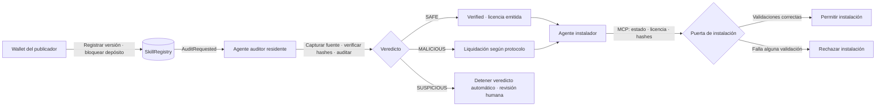

<div align="center">

# SkillGuard

[English](README.md) · [简体中文](README.zh-CN.md) · [Español](README.es.md) · [日本語](README.ja.md)

### Verifica las skills de agentes de IA antes de instalarlas, con evidencias auditables y resultados en cadena

**Registro por versión · Agente de auditoría residente · Puerta MCP de instalación · Arbitraje independiente**


[Especificación](SPEC.md) · [Aceptación de páginas](docs/ROLE-PAGES-ACCEPTANCE.md) · [Flujo del agente auditor](docs/tool-agent-auditing.md) · [Plan de arbitraje](docs/superpowers/plans/2026-10-08-independent-arbitration.md)

[Abrir el panel de solo lectura](https://yishengsss.github.io/SkillGuard/)

</div>

> **Estado de producción:** los contratos existentes en BOT Testnet (chain ID `968`) y el panel público usan **protocolo v1**. El código y la interfaz de arbitraje independiente de v2 están en este repositorio, pero **v2 no se ha desplegado en BOT**. El panel no muestra casos de arbitraje v2; no supongas que los depósitos de la implementación BOT están congelados o protegidos por arbitraje. Comprueba la red y `deployments.json` antes de firmar.

## Contenido

- [Descripción](#descripción)
- [Flujo](#flujo)
- [Versiones del protocolo](#versiones-del-protocolo)
- [Funciones](#funciones)
- [Inicio rápido](#inicio-rápido)
- [Panel de solo lectura](#panel-de-solo-lectura)
- [Aplicación web por roles](#aplicación-web-por-roles)
- [Comandos](#comandos)
- [Despliegue local del protocolo v2](#despliegue-local-del-protocolo-v2)
- [Pruebas y aceptación](#pruebas-y-aceptación)
- [Seguridad y limitaciones](#seguridad-y-limitaciones)
- [Estructura](#estructura)
- [Licencia](#licencia)

## Descripción

SkillGuard ofrece un flujo de verificación antes de instalar skills para agentes de IA. El publicador registra una versión concreta y sus hashes. Un agente auditor residente valida el origen, ejecuta comprobaciones de seguridad y registra el informe. Antes de instalar, el agente instalador puede usar herramientas MCP para comprobar el estado en cadena, la licencia y los hashes del contenido local.

Las personas firman sus propias transacciones con wallets EOA del navegador: el publicador bloquea depósitos, el operador auditor deposita stake y el administrador despliega contratos. En el protocolo v2, un árbitro independiente revisa los informes maliciosos provisionales; el tesoro público puede retirar los fondos que se le acrediten. El servidor prepara y verifica transacciones, pero no firma en nombre de publicadores ni administradores.

### Roles

| Rol | Responsabilidad | Credenciales / firma |
|---|---|---|
| Publicador | Registrar versiones, bloquear depósitos y retirar reembolsos | EOA del navegador; la demo CLI usa `PRIVATE_KEY` |
| Operador auditor | Depositar stake, ejecutar el servicio de auditoría y revisar resultados sospechosos | EOA del navegador; el servicio usa `AUDITOR_PRIVATE_KEY` |
| Administrador | Desplegar, conectar y activar contratos | Wallet owner del navegador; el despliegue CLI usa `OWNER_PRIVATE_KEY` |
| Árbitro independiente (v2) | Revisar evidencias y resolver casos provisionales antes del plazo | EOA separada; dirección pública `ARBITER_ADDRESS` |
| Tesoro público (v2) | Retirar fondos acreditados tras confirmar un resultado malicioso | Dirección separada `TREASURY_ADDRESS`; solo retira sus propios créditos |
| Agente instalador | Comprobar licencias y solicitar la instalación | Sin wallet; utiliza la puerta MCP |

En la demo, el operador del proyecto controla las wallets. Las direcciones del publicador, auditor y owner deben ser distintas. En v2, el árbitro y el tesoro también deben ser distintos entre sí y del owner.

## Flujo



### Veredictos y estados en cadena

| Veredicto / estado | Comportamiento |
|---|---|
| `SAFE` / `Verified (3)` | Se emite una licencia para la versión. v1 reembolsa de inmediato; v2 acredita al publicador para que retire los fondos. |
| `MALICIOUS` / v1 `Malicious (4)` | Se aplica la liquidación heredada del contrato existente. |
| Malicioso provisional / v2 `ArbitrationPending (5)` | El depósito queda congelado; no se paga al auditor informante ni se emite licencia mientras el arbitraje esté pendiente. |
| v2 `ArbitrationExpired (6)` | Al vencer el plazo, se acredita al publicador; la skill sigue sin verificar. |
| `SUSPICIOUS` | No se emite un veredicto automático en cadena. El informe se guarda en `reports/pending/` para revisión humana. |

La puerta permite instalar solo si el estado es Verified, existe una licencia y los `codeHash` y `metadataHash` locales coinciden con el registro en cadena.

## Versiones del protocolo

| | Protocolo v1 | Protocolo v2 |
|---|---|---|
| Estado malicioso | `Malicious (4)` | Empieza en `ArbitrationPending (5)`; puede terminar en `Malicious (4)`, `Verified (3)` o `ArbitrationExpired (6)` |
| Liquidación del depósito | Comportamiento heredado | Congelado durante la revisión; retiro pull tras arbitraje o vencimiento |
| Roles de arbitraje | Sin árbitro independiente | Árbitro y tesoro configurados una sola vez y bloqueados en cadena |
| Despliegue | Registry, License y conexiones | Los cuatro pasos anteriores más un quinto para configurar los roles de arbitraje |
| Implementación BOT actual | **Despliegue existente en chain ID 968** | No desplegado en BOT; requiere un despliegue y aceptación independientes |

El periodo de arbitraje v2 es de siete días. Si se confirma el comportamiento malicioso, el depósito se acredita al tesoro público. Si se revoca el informe, el publicador recibe una licencia Verified y un crédito reembolsable. Si vence el plazo, cualquiera puede finalizar la liquidación: se acredita al publicador, pero no se emite licencia. El informe final se guarda por separado y no sobrescribe el informe original del auditor.

## Funciones

- **Registro ligado a la versión:** cada versión almacena el origen, `codeHash` y `metadataHash`; una versión nueva necesita una auditoría nueva.
- **Comprobaciones por etapas:** reglas de metadatos, reglas de código fuente, similitud de nombres de paquetes y comprobaciones opcionales de consistencia con LLM. El agente residente audita una instantánea inmutable.
- **Informes auditables:** informes JSON canónicos vinculados a resultados en cadena mediante hash. Los eventos del agente modelo se muestran cuando existen; los registros históricos sin ejecución se identifican explícitamente.
- **Herramientas MCP de instalación:** `check_skill` consulta en solo lectura; `install_skill` copia solo tras validar y vuelve a comprobar el contenido copiado.
- **Aplicación web por roles:** catálogo, publicador, operaciones de auditoría, administrador, detalle, instalación y arbitraje independiente.
- **Compatibilidad de protocolo:** la interfaz detecta las capacidades del contrato y no presenta v1 como compatible con el arbitraje v2.

### Proceso del agente auditor

1. Lee eventos `AuditRequested` desde el cursor de bloque persistido.
2. Carga el `SkillRegistered` correspondiente y el estado actual; omite versiones ya procesadas.
3. Resuelve solo fuentes locales (ruta relativa a la raíz del proyecto o `file://`); rechaza URL remotas y escapes de ruta.
4. Valida nombre/versión del manifest y compara hashes locales con los registrados.
5. Ejecuta reglas sobre la misma instantánea inmutable y permite que el modelo configurado revise archivos y evidencias mediante herramientas de solo lectura.
6. Procesa SAFE/MALICIOUS según el protocolo. Guarda SUSPICIOUS para revisión humana sin transmitir un veredicto.

El agente nunca importa ni ejecuta código de la skill. Si la fuente no se puede leer, los hashes no coinciden, falla la revisión del modelo o la evidencia no es válida, no debe presentar el resultado como SAFE. El agente residente requiere una configuración de modelo válida.

### Hashes e informes

- `metadataHash` es Keccak-256 de los bytes originales de `manifest.json`.
- `codeHash` es Keccak-256 de una codificación determinista y no ambigua de rutas relativas ordenadas y contenidos. Se excluyen `.env*`, `.git`, cachés, enlaces simbólicos y archivos no regulares.
- `reportHash` se calcula sobre JSON canónico (claves ordenadas, separadores compactos, UTF-8); los bytes guardados coinciden con el hash enviado a la cadena.
- El arbitraje v2 guarda un informe final separado y lo vincula con el hash original, árbitro, decisión, motivo y evidencia de código fuente.

Estos formatos son compartidos por el registro, el envío de auditoría y las comprobaciones de instalación. Cambiarlos afecta a la compatibilidad de hashes.

## Inicio rápido

### Requisitos

- Python 3.11+
- Foundry: `anvil`, `forge` y `cast`
- Node.js: solo para las pruebas de módulos del navegador

```bash
git clone https://github.com/yishengsss/SkillGuard.git
cd SkillGuard

python3.11 -m venv .venv
.venv/bin/pip install -r requirements.txt
cp .env.example .env
```

Configura `RPC_URL` y las credenciales de roles en `.env`. Las claves privadas solo se usan en los flujos locales CLI/script; las transacciones de las páginas de roles se firman con wallets del navegador.

| Variable | Uso |
|---|---|
| `RPC_URL` | RPC de Anvil u otro endpoint EVM configurado |
| `PRIVATE_KEY` | Wallet del publicador para la demo CLI |
| `AUDITOR_PRIVATE_KEY` | Wallet del servicio auditor para stake y envíos CLI/worker |
| `OWNER_PRIVATE_KEY` | Wallet administrador del script CLI de despliegue |
| `ARBITER_ADDRESS`, `TREASURY_ADDRESS` | Direcciones públicas opcionales para despliegue v2 local; distintas entre sí y del owner |
| `LLM_API_KEY`, `LLM_BASE_URL`, `LLM_MODEL` | Necesarias para el agente modelo residente; no para el escaneo CLI basado solo en reglas |

**No uses fondos reales ni claves de producción en la demo local.** Git ignora `.env`.

### Ejecutar la demo local

Terminal 1:

```bash
anvil
```

Terminal 2:

```bash
./demo.sh --no-pause
```

El script comprueba la separación de roles, despliega si hace falta, realiza el stake humano, inicia el auditor residente, registra `weather` y `mail-helper`, espera los resultados en cadena y prueba la instalación MCP. El agente necesita una configuración LLM válida. Reinicia Anvil antes de repetir: las versiones registradas no se sobrescriben.

Para usar Anvil local sin modificar `.env`:

```bash
DEMO_RPC_URL=http://127.0.0.1:8545 ./demo.sh --no-pause
```

## Panel de solo lectura

[Abrir el panel](https://yishengsss.github.io/SkillGuard/). Lee el despliegue BOT Testnet v1 existente (chain ID `968`) y no envía transacciones. El arbitraje v2 no está desplegado en BOT y el panel no muestra casos v2.

## Aplicación web por roles

Inicia el servicio web local:

```bash
.venv/bin/python -m ops.server --port 8765
```

Abre <http://127.0.0.1:8765/>. El servicio solo escucha en loopback; no lo expongas mediante proxy inverso ni a una red pública.

Para probar roles de forma aislada, el harness crea otra instancia Anvil y usa wallets públicas de prueba. Nunca envíes activos reales a esas wallets:

```bash
.venv/bin/python tests/role_demo.py --rpc-port 18857 --port 18701
```

Añade `--mock-agent` para probar el flujo v2 de arbitraje de extremo a extremo. La interfaz indica claramente que es un **fixture determinista de protocolo, no una auditoría de IA**. Las wallets y transacciones de prueba quedan limitadas al Anvil aislado.

### Servidor de instalación MCP

Cualquier agente compatible puede invocar las herramientas stdio:

```bash
.venv/bin/python gate/mcp_server.py
```

Las herramientas son `check_skill(skill_dir)` e `install_skill(skill_dir)`. `demo-agent/.mcp.json` es una configuración de ejemplo. Configura el cliente MCP para usar un intérprete Python con las dependencias del repositorio.

## Comandos

```bash
# Auditoría de reglas; no ejecuta el código de la skill
.venv/bin/python -m auditor.cli samples/weather

# Stake humano y agente auditor residente
.venv/bin/python -m auditor.stake
.venv/bin/python -m auditor.agent [--once] [--from-block N] [--poll SECONDS]

# Decisión humana sobre un informe SUSPICIOUS
.venv/bin/python -m auditor.cli <skill-dir> --submit --human-decision safe
.venv/bin/python -m auditor.cli <skill-dir> --submit --human-decision malicious

# Puerta de instalación legible por personas
.venv/bin/python gate/gate.py install samples/weather

# Pruebas
(cd contracts && forge test -vv)
.venv/bin/python -m pytest -q -m 'not anvil'
node --test tests/web/*.test.mjs
```

## Desplegar protocolo v2 localmente

Para un despliegue nuevo en Anvil, añade dos direcciones públicas a `.env` (son direcciones, no claves privadas):

```dotenv
ARBITER_ADDRESS=0x...   # árbitro independiente
TREASURY_ADDRESS=0x...  # destinatario de fondos públicos
```

El script activa v2 solo si ambas están configuradas y pasan las comprobaciones de separación de roles. Tras configurarlas, quedan bloqueadas en cadena. Cambiar de red o de direcciones de despliegue no migra registros, stake ni informes. El contrato v1 existente en BOT no se actualiza al cambiar la configuración local o el código.

## Pruebas y aceptación

```bash
# Regresión Python normal
.venv/bin/python -m pytest -q -m 'not anvil'

# Flujos HTTP por rol, despliegue, verificación de transacciones e integración local
.venv/bin/python -m pytest tests/test_roles_e2e.py tests/test_ops_chain.py \
  tests/test_ops_transactions.py tests/test_ops_admin.py -q

# Pruebas de módulos del navegador
node --test tests/web/*.test.mjs

# Contratos Solidity
(cd contracts && forge test -vv)
```

Consulta [la aceptación de páginas por rol](docs/ROLE-PAGES-ACCEPTANCE.md) para resultados registrados, límites de versión y comprobaciones de extensiones de wallet que aún requieren validación manual.

## Seguridad y limitaciones

- Las skills de demo son **fixtures de texto inertes**. Contienen cadenas que activan reglas, pero no leen credenciales reales, acceden a la red ni ejecutan comandos externos.
- Las reglas pueden omitir contenido malicioso o marcar contenido benigno. Una auditoría no demuestra seguridad.
- Cada informe lo envía un solo auditor. v1 no tiene arbitraje independiente; v2 añade un revisor, pero su decisión tampoco es infalible.
- No hay tarifa de auditoría y el stake del auditor no se puede retirar actualmente. La liquidación depende de la versión del contrato.
- El origen solo puede ser local; no se descargan repositorios Git remotos. El agente no ejecuta el código subido.
- La puerta MCP es un contrato de integración, no un hook obligatorio del sistema operativo o de la plataforma del agente. El agente podría copiar archivos por otro mecanismo.
- El servicio web por roles forma parte de la frontera de confianza local y puede acceder a configuración local y servicios de auditoría. Úsalo solo en loopback para desarrollo/demo.
- El despliegue BOT existente es v1. Este README no despliega, migra ni envía transacciones a BOT.

Consulta la hoja de ruta en [SPEC.md](SPEC.md) §11.3 y el [plan de implementación del arbitraje v2](docs/superpowers/plans/2026-10-08-independent-arbitration.md).

## Estructura del repositorio

| Ruta | Propósito |
|---|---|
| `contracts/` | Registry Solidity, License ERC-721, scripts de despliegue y pruebas Foundry |
| `auditor/` | Escáner de reglas, hashes de informes, agente residente, worker, journal y recuperación |
| `gate/` | Puerta de instalación Python y servidor MCP |
| `ops/` | Aplicación HTTP local, autenticación wallet, preparación/verificación de transacciones, auditoría y arbitraje |
| `web/` | Páginas por rol, panel de solo lectura y módulos compartidos del navegador |
| `rules/` | Reglas YAML y lista de nombres de paquetes conocidos |
| `samples/` | Fixtures inertes seguros, maliciosos y pendientes de auditoría |
| `tests/` | Pruebas Python, Foundry, Node y Anvil aislado |
| `docs/` | Especificaciones, aceptación, auditoría y planes de arbitraje |

## Licencia

Este proyecto usa [MIT License](LICENSE), de acuerdo con los encabezados SPDX de los contratos Solidity. Las dependencias y submódulos de terceros conservan sus propias licencias; consulta sus avisos por separado.
