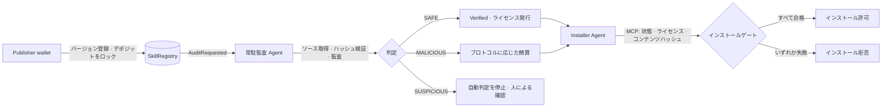

<div align="center">

# SkillGuard

[English](README.md) · [简体中文](README.zh-CN.md) · [Español](README.es.md) · [日本語](README.ja.md)

### AI Agent のスキルをインストール前に検証し、証跡とオンチェーン結果を追跡可能にする

**バージョン登録 · 常駐監査 Agent · MCP インストールゲート · 独立仲裁**


[仕様](SPEC.md) · [ロール別ページの受け入れ記録](docs/ROLE-PAGES-ACCEPTANCE.md) · [監査 Agent の説明](docs/tool-agent-auditing.md) · [仲裁実装計画](docs/superpowers/plans/2026-10-08-independent-arbitration.md)

[読み取り専用ダッシュボードを開く](https://yishengsss.github.io/SkillGuard/)

</div>

> **稼働中デプロイの状態：** BOT Testnet（chain ID `968`）上の既存コントラクトとオンライン読み取り専用ダッシュボードは **プロトコル v1** です。v2 の独立仲裁コードと UI は本リポジトリにありますが、**BOT にはまだデプロイされていません**。オンラインダッシュボードには v2 仲裁案件は表示されません。現在の BOT デプロイでデポジットが凍結される、または独立仲裁の対象になると想定しないでください。署名前にネットワークと `deployments.json` を確認してください。

## 目次

- [概要](#概要)
- [ワークフロー](#ワークフロー)
- [プロトコルのバージョン](#プロトコルのバージョン)
- [機能](#機能)
- [クイックスタート](#クイックスタート)
- [読み取り専用ダッシュボード](#読み取り専用ダッシュボード)
- [ロール別 Web アプリ](#ロール別-web-アプリ)
- [コマンド](#コマンド)
- [プロトコル v2 のローカルデプロイ](#プロトコル-v2-のローカルデプロイ)
- [テストと受け入れ](#テストと受け入れ)
- [セキュリティと制限](#セキュリティと制限)
- [リポジトリ構成](#リポジトリ構成)
- [ライセンス](#ライセンス)

## 概要

SkillGuard は、AI Agent スキルのインストール前検証フローを提供します。Publisher は特定バージョンとコンテンツハッシュを登録します。常駐監査 Agent がソースを検証し、セキュリティチェックを実行してレポートを記録します。インストール前に Installer Agent は MCP ツールでオンチェーン状態、ライセンス、ローカルのコンテンツハッシュを確認できます。

人がブラウザーの EOA ウォレットで自分のトランザクションに署名します。Publisher はデポジットをロックし、監査運用者は stake し、Administrator はコントラクトをデプロイします。プロトコル v2 では、独立した Arbiter が暫定的な悪意レポートを審査し、Public Treasury は自身に計上された資金を引き出せます。Web サーバーはトランザクションを準備して検証しますが、Publisher や Administrator の代わりに署名しません。

### ロール

| ロール | 責務 | 認証情報 / 署名 |
|---|---|---|
| Publisher | スキルバージョンの登録、デポジットのロック、返金の受け取り | ブラウザー EOA。CLI デモでは `PRIVATE_KEY` |
| 監査運用者 | stake、監査サービスの起動、疑わしい結果の確認 | ブラウザー EOA。常駐サービスでは `AUDITOR_PRIVATE_KEY` |
| Administrator | コントラクトのデプロイ、接続、アクティベート | ブラウザーの owner ウォレット。CLI では `OWNER_PRIVATE_KEY` |
| 独立 Arbiter（v2） | 期限前に証拠を確認し、暫定的な悪意案件を裁定 | 専用ブラウザー EOA。公開アドレス `ARBITER_ADDRESS` |
| Public Treasury（v2） | 悪意が確定した後に計上された資金を引き出す | 専用アドレス `TREASURY_ADDRESS`。自身の credits のみ引き出し可能 |
| Installer Agent | ライセンスを確認してインストールを要求 | ウォレット不要。MCP ゲートを呼び出す |

デモ用ウォレットはプロジェクト運用者が管理します。Publisher、Auditor、owner のアドレスはそれぞれ異なる必要があります。v2 では Arbiter と Treasury も互いに、また owner と異なる必要があります。

## ワークフロー



### 判定とオンチェーン状態

| 判定 / 状態 | 動作 |
|---|---|
| `SAFE` / `Verified (3)` | バージョンライセンスを発行。v1 は即時返金、v2 は Publisher の pull 方式出金 credit に計上。 |
| `MALICIOUS` / v1 `Malicious (4)` | 既存コントラクトの旧精算ルールを適用。 |
| 暫定的な悪意 / v2 `ArbitrationPending (5)` | デポジットを凍結。仲裁中は報告者へ支払わず、ライセンスも発行しない。 |
| v2 `ArbitrationExpired (6)` | 仲裁期限後、Publisher に credit を計上。スキルは未検証のまま。 |
| `SUSPICIOUS` | オンチェーンへ自動判定を送信しない。人の確認用に `reports/pending/` へ保存。 |

インストールゲートは、状態が Verified でライセンスが存在し、ローカル `codeHash` と `metadataHash` がオンチェーン登録と一致した場合のみ許可します。

## プロトコルのバージョン

| | プロトコル v1 | プロトコル v2 |
|---|---|---|
| 悪意状態 | `Malicious (4)` | `ArbitrationPending (5)` から開始。最終的に `Malicious (4)`、`Verified (3)`、または期限後の `ArbitrationExpired (6)` |
| デポジット精算 | 既存コントラクトの旧動作 | 裁定または期限切れまで凍結し、その後 pull 方式で出金 |
| 仲裁ロール | 独立 Arbiter なし | Arbiter と Treasury を一度だけ設定し、オンチェーンでロック |
| デプロイ | Registry、License、相互接続 | 最初の4ステップに、仲裁ロール設定の第5ステップを追加 |
| 現在の BOT デプロイ | **chain ID 968 の既存デプロイ** | BOT 未デプロイ。別途デプロイと受け入れが必要 |

v2 の仲裁期間は7日です。悪意が確定するとデポジットは Public Treasury に計上されます。報告が覆された場合、Publisher は Verified ライセンスと返金 credit を受け取ります。期限切れの場合は誰でも精算を実行できますが、Publisher に credit が計上されるだけでライセンスは発行されません。最終仲裁レポートは別途保存され、元の監査レポートを書き換えません。

## 機能

- **バージョン単位の登録：** ソース、`codeHash`、`metadataHash` を記録。新バージョンには新たな監査が必要です。
- **段階的チェック：** メタデータルール、ソースコードルール、パッケージ名類似チェック、任意の LLM 一貫性チェック。常駐 Agent は不変のソーススナップショットを監査します。
- **監査可能なレポート：** canonical JSON レポートをハッシュでオンチェーン結果に関連付けます。モデル Agent のイベントは存在する場合に表示し、実行ログのない履歴は明示します。
- **MCP インストールツール：** `check_skill` は読み取り専用、`install_skill` は検証後にのみコピーし、コピー後に再検証します。
- **ロール別 Web アプリ：** カタログ、Publisher、監査運用、Administrator、スキル詳細、インストール、独立仲裁。
- **プロトコル互換性：** UI はデプロイ済みコントラクトの能力を読み取り、v1 を v2 仲裁対応として表示しません。

### 監査 Agent の処理

1. 保存されたブロックカーソルから `AuditRequested` イベントを読み取ります。
2. 対応する `SkillRegistered` と現在のオンチェーン状態を取得し、処理済みバージョンはスキップします。
3. ローカルソース（プロジェクトルート相対パスまたは `file://`）のみ解決し、リモート URL とパス逸脱を拒否します。
4. manifest の名前/バージョンを検証し、ローカルハッシュを登録済みハッシュと比較します。
5. 同一の不変スナップショットをルール検査し、設定済みの tool-calling model が読み取り専用ツールでファイルと証拠を確認します。
6. SAFE/MALICIOUS はプロトコルに従って処理し、SUSPICIOUS は人の確認用に保存して自動送信しません。

Agent はスキルコードを import / 実行しません。ソースを読めない、ハッシュが一致しない、モデル監査が失敗する、証拠が無効などの場合、SAFE として扱いません。常駐 Agent には有効なモデル設定が必要です。

### ハッシュとレポート

- `metadataHash` は `manifest.json` の生バイト列に対する Keccak-256 です。
- `codeHash` は、ソート済み相対パスとファイル内容の決定的かつ曖昧さのないエンコードに対する Keccak-256 です。`.env*`、`.git`、キャッシュ、シンボリックリンク、通常ファイルでないものは除外します。
- `reportHash` は canonical JSON（キー順、コンパクトな区切り、UTF-8）から算出し、保存されたレポートのバイト列がオンチェーン送信ハッシュに一致します。
- v2 の最終仲裁レポートは別保存し、元レポートハッシュ、Arbiter、判定、理由、ソース証拠に関連付けます。

これらの形式は登録、監査送信、インストール検査で共有されます。変更すると既存ハッシュとの互換性に影響します。

## クイックスタート

### 要件

- Python 3.11+
- Foundry: `anvil`、`forge`、`cast`
- Node.js: ブラウザーモジュールのテストのみ必要

```bash
git clone https://github.com/yishengsss/SkillGuard.git
cd SkillGuard

python3.11 -m venv .venv
.venv/bin/pip install -r requirements.txt
cp .env.example .env
```

`.env` に `RPC_URL` とロール設定を記述します。秘密鍵はローカル CLI/script 用です。ロールページのトランザクションはブラウザーウォレットで署名します。

| 変数 | 用途 |
|---|---|
| `RPC_URL` | Anvil または設定済み EVM RPC |
| `PRIVATE_KEY` | CLI デモ用 Publisher wallet |
| `AUDITOR_PRIVATE_KEY` | stake および CLI/worker 監査送信用の監査サービス wallet |
| `OWNER_PRIVATE_KEY` | CLI デプロイスクリプト用 Administrator wallet |
| `ARBITER_ADDRESS`、`TREASURY_ADDRESS` | ローカル v2 デプロイ用の公開アドレス。互いに、また owner と異なる必要があります |
| `LLM_API_KEY`、`LLM_BASE_URL`、`LLM_MODEL` | 常駐モデル Agent に必要。ルールのみの CLI スキャンでは不要 |

**ローカルデモに本番秘密鍵や実資産を使わないでください。** `.env` は Git の対象外です。

### ローカルデモ

ターミナル1：

```bash
anvil
```

ターミナル2：

```bash
./demo.sh --no-pause
```

スクリプトはロール分離を確認し、必要に応じてデプロイ、人による stake、常駐監査 worker の起動、`weather` と `mail-helper` の登録、オンチェーン結果待ち、MCP インストール確認を実行します。Agent には有効な LLM 設定が必要です。再実行時は Anvil を再起動してください。登録済みバージョンは上書きできません。

`.env` を変えずにローカル Anvil を使う場合：

```bash
DEMO_RPC_URL=http://127.0.0.1:8545 ./demo.sh --no-pause
```

## 読み取り専用ダッシュボード

[ライブダッシュボードを開く](https://yishengsss.github.io/SkillGuard/)。既存の BOT Testnet v1（chain ID `968`）を読み取り、トランザクションは送信しません。v2 仲裁は BOT 未デプロイのため、v2 案件は表示されません。

## ロール別 Web アプリ

ローカル Web サービスを起動：

```bash
.venv/bin/python -m ops.server --port 8765
```

<http://127.0.0.1:8765/> を開きます。サービスは loopback のみで待ち受けます。reverse proxy や公開ネットワークにさらさないでください。

ロールを隔離して試すには、別の Anvil と公開テスト wallet を作成するハーネスを使います。これらの wallet に実資産を送らないでください：

```bash
.venv/bin/python tests/role_demo.py --rpc-port 18857 --port 18701
```

v2 の仲裁フローを一通り試すには `--mock-agent` を追加します。画面には**決定的なプロトコルテスト fixture であり、AI 監査ではない**ことが明示されます。テスト用 wallet とトランザクションは隔離 Anvil 内に限定されます。

### MCP インストールサーバー

MCP 対応 Agent は stdio ツールを呼び出せます：

```bash
.venv/bin/python gate/mcp_server.py
```

ツールは `check_skill(skill_dir)` と `install_skill(skill_dir)` です。`demo-agent/.mcp.json` はクライアント設定例です。MCP クライアントには本リポジトリの依存関係がインストールされた Python を指定してください。

## コマンド

```bash
# ルール監査。スキルコードは実行しない
.venv/bin/python -m auditor.cli samples/weather

# 人による stake と常駐監査 Agent
.venv/bin/python -m auditor.stake
.venv/bin/python -m auditor.agent [--once] [--from-block N] [--poll SECONDS]

# SUSPICIOUS レポートへの人手判定
.venv/bin/python -m auditor.cli <skill-dir> --submit --human-decision safe
.venv/bin/python -m auditor.cli <skill-dir> --submit --human-decision malicious

# 人向けインストールゲート
.venv/bin/python gate/gate.py install samples/weather

# テスト
(cd contracts && forge test -vv)
.venv/bin/python -m pytest -q -m 'not anvil'
node --test tests/web/*.test.mjs
```

## プロトコル v2 をローカルでデプロイ

新しい Anvil デプロイでは、`.env` に2つの公開 wallet アドレスを追加します（秘密鍵ではありません）：

```dotenv
ARBITER_ADDRESS=0x...   # 独立 Arbiter
TREASURY_ADDRESS=0x...  # 公共資金の受取先
```

両方のアドレスが設定され、ロール分離の検査を通過した場合のみデプロイスクリプトが v2 を有効化します。仲裁ロールの設定後はオンチェーンでロックされます。ネットワークやデプロイ先を変更しても、登録、stake、レポートは移行されません。ローカル設定やコードを変更しても、既存の BOT v1 コントラクトはアップグレードされません。

## テストと受け入れ

```bash
# 通常の Python 回帰
.venv/bin/python -m pytest -q -m 'not anvil'

# ロール HTTP フロー、デプロイ、トランザクション検証、ローカルチェーン統合
.venv/bin/python -m pytest tests/test_roles_e2e.py tests/test_ops_chain.py \
  tests/test_ops_transactions.py tests/test_ops_admin.py -q

# ブラウザーモジュール
node --test tests/web/*.test.mjs

# Solidity コントラクト
(cd contracts && forge test -vv)
```

[ロールページの受け入れ記録](docs/ROLE-PAGES-ACCEPTANCE.md)には、記録済みのテスト結果、デプロイバージョンの境界、手動確認が必要な wallet 拡張の項目があります。

## セキュリティと制限

- デモスキルは**実行されないテキスト fixture**です。ルールに一致する文字列を含みますが、実際の認証情報を読まず、ネットワークへ接続せず、外部コマンドも実行しません。
- ルールベース検査は悪意ある内容を見逃したり、無害な内容を誤検出したりする可能性があります。監査は安全性の証明ではありません。
- 各レポートは単一の監査者が送信します。v1 に独立仲裁はありません。v2 でも仲裁の誤りを完全には排除できません。
- 監査手数料はなく、監査者の stake は現在引き出せません。精算動作はコントラクトのプロトコルバージョンによって異なります。
- ソース解決はローカルのみです。リモート Git の取得は未実装です。Agent はアップロードされたスキルコードを実行しません。
- MCP インストールゲートは Agent との連携仕様であり、OS や Agent プラットフォームによる強制 hook ではありません。Agent が別の方法でファイルをコピーする可能性があります。
- ロール Web サービスはローカルの信頼境界の一部で、ローカル設定や監査サービスにアクセスできます。開発/デモでは loopback のみで使用してください。
- 既存 BOT デプロイは v1 です。この README は BOT へのデプロイ、移行、トランザクション送信を行いません。

ロードマップは [SPEC.md](SPEC.md) §11.3、v2 設計と受け入れの詳細は[仲裁 v2 実装計画](docs/superpowers/plans/2026-10-08-independent-arbitration.md)を参照してください。

## リポジトリ構成

| パス | 用途 |
|---|---|
| `contracts/` | Solidity Registry、ERC-721 License、デプロイスクリプト、Foundry テスト |
| `auditor/` | ルールスキャナー、レポートハッシュ、常駐 Agent、worker、journal、復旧処理 |
| `gate/` | Python インストールゲートと MCP サーバー |
| `ops/` | ローカル HTTP アプリ、wallet 認証、トランザクション準備/検証、監査・仲裁サービス |
| `web/` | ロールページ、読み取り専用ダッシュボード、共有ブラウザーモジュール |
| `rules/` | YAML ルールと既知パッケージ名 |
| `samples/` | 安全/悪意/監査待ちの不活性 fixture |
| `tests/` | Python、Foundry、Node、隔離 Anvil テスト |
| `docs/` | 仕様、受け入れ記録、監査・仲裁計画 |

## ライセンス

本プロジェクトは [MIT License](LICENSE) です。Solidity の SPDX 表記と一致します。サードパーティ依存関係や submodule にはそれぞれ独自のライセンスが適用されます。個別のライセンス通知も確認してください。
