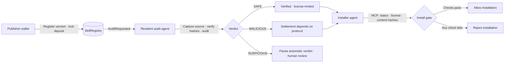

<div align="center">

# SkillGuard

[English](README.md) · [简体中文](README.zh-CN.md)

### Verify AI-agent skills before installation—with auditable evidence and on-chain outcomes

**Versioned skill registry · Resident audit agent · MCP install gate · Independent arbitration**


[Specification](SPEC.md) · [Role-page acceptance](docs/ROLE-PAGES-ACCEPTANCE.md) · [Audit-agent workflow](docs/tool-agent-auditing.md) · [Arbitration plan](docs/superpowers/plans/2026-10-08-independent-arbitration.md)

[Open the read-only dashboard](https://yishengsss.github.io/SkillGuard/)

</div>

> **Live deployment status:** The existing contracts on BOT Testnet (chain ID `968`) and the online read-only dashboard use **protocol v1**. Protocol-v2 arbitration code and UI are in this repository but have **not** been deployed to BOT. The live dashboard does not show v2 arbitration cases; do not assume deposits on the current BOT deployment are frozen or covered by independent arbitration. Verify the active network and `deployments.json` before signing.

## Contents

- [Overview](#overview)
- [Workflow](#workflow)
- [Protocol versions](#protocol-versions)
- [Features](#features)
- [Quick start](#quick-start)
- [Read-only dashboard](#read-only-dashboard)
- [Role-based web app](#role-based-web-app)
- [Commands](#commands)
- [Protocol-v2 deployment](#protocol-v2-deployment)
- [Tests and acceptance](#tests-and-acceptance)
- [Security and limitations](#security-and-limitations)
- [Repository layout](#repository-layout)
- [License](#license)

## Overview

SkillGuard provides a pre-install verification flow for AI-agent skills. A publisher registers a specific skill version and its content hashes. A resident audit agent validates the source, runs security checks, and records its report. Before installation, an installer agent can use MCP tools to check the on-chain status, license, and local content hashes.

People sign their own transactions with browser EOA wallets: publishers lock deposits, audit operators stake, and administrators deploy contracts. Under protocol v2, a separate arbiter reviews provisional malicious reports; a public treasury can withdraw its credited funds. The web server prepares and verifies transactions but does not sign for publishers or administrators.

### Roles

| Role | Responsibility | Credentials / signing |
|---|---|---|
| Publisher | Register skill versions, lock deposits, withdraw refunds | Browser EOA; CLI demo uses `PRIVATE_KEY` |
| Audit operator | Stake, run the audit service, review suspicious results | Browser EOA; resident service uses `AUDITOR_PRIVATE_KEY` |
| Administrator | Deploy, wire, and activate contracts | Browser owner wallet; CLI deployment uses `OWNER_PRIVATE_KEY` |
| Independent arbiter (v2) | Review evidence and decide provisional malicious cases before the deadline | Separate browser EOA; public address configured as `ARBITER_ADDRESS` |
| Public treasury (v2) | Withdraw funds credited after a malicious verdict is confirmed | Separate `TREASURY_ADDRESS`; can withdraw only its own credits |
| Installer agent | Check licenses and request installation | No wallet; calls the MCP gate |

Demo wallets are controlled by the project operator. Publisher, auditor, and owner addresses must be distinct. In v2, the arbiter and treasury must also be distinct from each other and from the owner.

## Workflow



### Verdicts and on-chain states

| Verdict / state | Behavior |
|---|---|
| `SAFE` / `Verified (3)` | A version license is minted. Protocol v1 refunds immediately; v2 credits the publisher for pull withdrawal. |
| `MALICIOUS` / v1 `Malicious (4)` | Uses the legacy settlement behavior of the existing contract. |
| Provisional malicious / v2 `ArbitrationPending (5)` | Deposit is frozen; no reward is paid to the reporting auditor and no license is minted while arbitration is pending. |
| v2 `ArbitrationExpired (6)` | After the arbitration deadline, the publisher is credited; the skill remains unverified. |
| `SUSPICIOUS` | No automatic on-chain verdict. The report is stored under `reports/pending/` for human review. |

The install gate allows a skill only when its status is Verified, its license exists, and its local `codeHash` and `metadataHash` match the on-chain registration.

## Protocol versions

| | Protocol v1 | Protocol v2 |
|---|---|---|
| Malicious state | `Malicious (4)` | Starts at `ArbitrationPending (5)`; final state can be `Malicious (4)` or `Verified (3)`, or `ArbitrationExpired (6)` after timeout |
| Deposit settlement | Legacy contract behavior | Frozen pending a decision; pull withdrawals after arbitration or timeout |
| Arbitration roles | No independent arbiter | One-time, on-chain-locked arbiter and treasury |
| Deployment | Registry, License, and wiring | Same first four steps, plus a fifth step to configure arbitration roles |
| Current BOT deployment | **Existing deployment on chain ID 968** | Not deployed to BOT; requires a separate deployment and acceptance |

The v2 arbitration window is seven days. If malicious behavior is confirmed, the deposit is credited to the public treasury. If the report is overturned, the publisher receives a Verified license and a refundable credit. If the deadline expires, anyone can trigger settlement: the publisher is credited, but no license is minted. The final arbitration report is stored separately and does not rewrite the original auditor's report.

## Features

- **Version-bound registration:** each version stores its source, `codeHash`, and `metadataHash`; a new version requires a new audit.
- **Multi-stage checks:** metadata rules, source-code rules, package-name similarity checks, and optional LLM consistency checks. The resident agent audits an immutable source snapshot.
- **Auditable reports:** canonical JSON reports are linked to on-chain outcomes by hash. Model-agent events are shown when available; historical records without a run log are labeled accordingly.
- **MCP install tools:** `check_skill` performs read-only checks; `install_skill` copies only after validation and verifies the copied content again.
- **Role-based web app:** catalogue, publisher, audit operations, administrator, skill detail, install, and independent arbitration pages.
- **Protocol compatibility:** the UI reads the deployed contract's capabilities and does not present a v1 contract as supporting v2 arbitration.

### Audit-agent processing

1. Read `AuditRequested` events from the persisted block cursor.
2. Load the corresponding `SkillRegistered` entry and current on-chain status; skip versions already processed.
3. Resolve only local sources (a project-root-relative path or `file://`); reject remote URLs and path escapes.
4. Validate manifest name/version and compare local source and manifest hashes with the registered hashes.
5. Run rule checks on the same immutable source snapshot, then let the configured tool-calling model review files and evidence through read-only tools.
6. Process SAFE/MALICIOUS according to the contract protocol. Store SUSPICIOUS reports for human review without broadcasting a verdict.

The agent never imports or executes skill code. If the source cannot be read, hashes do not match, model review fails, or evidence is invalid, the agent must not present the result as SAFE. The resident agent requires valid model configuration.

### Hashes and reports

- `metadataHash` is Keccak-256 of the raw `manifest.json` bytes.
- `codeHash` is Keccak-256 of a deterministic, unambiguous encoding of sorted relative paths and file contents. `.env*`, `.git`, caches, symlinks, and non-regular files are excluded.
- `reportHash` is calculated from canonical JSON (sorted keys, compact separators, UTF-8); the saved report bytes correspond to the hash submitted on-chain.
- v2 arbitration stores a separate final review report linked to the original report hash, arbiter, decision, reason, and source evidence.

These formats are shared by registration, audit submission, and installation checks. Changing them affects hash compatibility.

## Quick start

### Requirements

- Python 3.11+
- Foundry: `anvil`, `forge`, and `cast`
- Node.js: only required for browser-module tests

```bash
git clone https://github.com/yishengsss/SkillGuard.git
cd SkillGuard

python3.11 -m venv .venv
.venv/bin/pip install -r requirements.txt
cp .env.example .env
```

Configure `RPC_URL` and the role credentials in `.env`. Private keys are used only by local CLI/script paths; role-page transactions are signed by browser wallets.

| Variable | Purpose |
|---|---|
| `RPC_URL` | Anvil or another configured EVM RPC endpoint |
| `PRIVATE_KEY` | Publisher wallet for the CLI demo |
| `AUDITOR_PRIVATE_KEY` | Audit service wallet for staking and CLI/worker submissions |
| `OWNER_PRIVATE_KEY` | Administrator wallet used by the CLI deployment script |
| `ARBITER_ADDRESS`, `TREASURY_ADDRESS` | Optional public addresses for a local v2 deployment; must be distinct from each other and the owner |
| `LLM_API_KEY`, `LLM_BASE_URL`, `LLM_MODEL` | Required by the resident model agent; not required for rules-only CLI scans |

**Do not use real mainnet funds or production private keys for the local demo.** `.env` is ignored by Git.

### Run the local demo

Terminal 1:

```bash
anvil
```

Terminal 2:

```bash
./demo.sh --no-pause
```

The script checks role separation, deploys when needed, requests human-operated staking, starts the resident audit worker, registers `weather` and `mail-helper`, waits for on-chain results, then exercises MCP installation. The agent needs a working LLM configuration. Restart Anvil before rerunning: registered versions cannot be overwritten.

To use local Anvil without changing `.env`:

```bash
DEMO_RPC_URL=http://127.0.0.1:8545 ./demo.sh --no-pause
```

## Read-only dashboard

[Open the live dashboard](https://yishengsss.github.io/SkillGuard/). It reads the existing BOT Testnet v1 deployment (chain ID `968`) and sends no transactions. Protocol-v2 arbitration is not deployed on BOT; the live dashboard does not show v2 arbitration cases.

## Role-based web app

Start the local web service:

```bash
.venv/bin/python -m ops.server --port 8765
```

Open <http://127.0.0.1:8765/>. The service binds to loopback only; do not expose it through a reverse proxy or public network.

For an isolated role walkthrough, a test harness starts a separate Anvil instance and uses public test wallets. Never send real assets to those wallets:

```bash
.venv/bin/python tests/role_demo.py --rpc-port 18857 --port 18701
```

### MCP installation server

Any compatible agent can call the stdio tools:

```bash
.venv/bin/python gate/mcp_server.py
```

The tools are `check_skill(skill_dir)` and `install_skill(skill_dir)`. `demo-agent/.mcp.json` is an example client configuration. Configure the MCP client to use a Python interpreter with this repository's dependencies installed.

## Commands

```bash
# Rules-only audit; does not execute skill code
.venv/bin/python -m auditor.cli samples/weather

# Human-operated stake and resident audit agent
.venv/bin/python -m auditor.stake
.venv/bin/python -m auditor.agent [--once] [--from-block N] [--poll SECONDS]

# Human decision for a SUSPICIOUS report
.venv/bin/python -m auditor.cli <skill-dir> --submit --human-decision safe
.venv/bin/python -m auditor.cli <skill-dir> --submit --human-decision malicious

# Human-readable install gate
.venv/bin/python gate/gate.py install samples/weather

# Tests
(cd contracts && forge test -vv)
.venv/bin/python -m pytest -q -m 'not anvil'
node --test tests/web/*.test.mjs
```

## Deploy protocol v2 locally

For a fresh local Anvil deployment, add two public wallet addresses to `.env` (these are addresses, not private keys):

```dotenv
ARBITER_ADDRESS=0x...   # independent arbiter
TREASURY_ADDRESS=0x...  # public funds recipient
```

The deployment script enables v2 only when both addresses are configured and role separation checks pass. Arbitration roles are locked on-chain after configuration. Changing networks or deployment addresses does not migrate registrations, stake, or reports. The existing BOT v1 contract is not upgraded by changing local configuration or code.

## Tests and acceptance

```bash
# Regular Python regression suite
.venv/bin/python -m pytest -q -m 'not anvil'

# Role HTTP flows, deployment, transaction checks, and local-chain integration
.venv/bin/python -m pytest tests/test_roles_e2e.py tests/test_ops_chain.py \
  tests/test_ops_transactions.py tests/test_ops_admin.py -q

# Browser-module tests
node --test tests/web/*.test.mjs

# Solidity contracts
(cd contracts && forge test -vv)
```

See [role-page acceptance](docs/ROLE-PAGES-ACCEPTANCE.md) for recorded results, deployment-version boundaries, and wallet-extension checks that still require manual verification.

## Security and limitations

- Demo skills are **inert text fixtures**. They contain strings that trigger audit rules, but do not read real credentials, access the network, or execute external commands.
- Rule-based checks can miss malicious behavior or flag benign content. An audit is not proof of safety.
- A single auditor submits each report. Protocol v1 has no independent arbitration; v2 adds a reviewer but cannot make that review infallible.
- There is no audit fee, and auditor stake cannot currently be withdrawn. Settlement behavior depends on the contract protocol version.
- Source resolution is local-only; fetching remote Git repositories is not implemented. The agent does not execute uploaded skill code.
- The MCP install gate is an integration contract, not an OS- or agent-platform-enforced hook. An agent could copy files through another mechanism.
- The role web service is part of the local trust boundary and may access local configuration and audit services. Use it only on loopback for development/demo.
- The existing BOT deployment is v1. This README does not deploy, migrate, or send any BOT transactions.

See [SPEC.md](SPEC.md) §11.3 for the roadmap and the [v2 arbitration implementation plan](docs/superpowers/plans/2026-10-08-independent-arbitration.md) for design and acceptance details.

## Repository layout

| Path | Purpose |
|---|---|
| `contracts/` | Solidity Registry, ERC-721 License, deployment scripts, and Foundry tests |
| `auditor/` | Rule scanner, report hashing, resident agent, worker, journal, and recovery |
| `gate/` | Python install gate and MCP installation server |
| `ops/` | Local HTTP app, wallet authentication, transaction preparation/verification, audit and arbitration services |
| `web/` | Role pages, read-only dashboard, and shared browser modules |
| `rules/` | YAML rules and known package-name list |
| `samples/` | Safe, malicious, and pending-audit inert fixtures |
| `tests/` | Python, Foundry, Node, and isolated-Anvil regression tests |
| `docs/` | Specifications, acceptance notes, audit and arbitration plans |

## License

This project is licensed under the [MIT License](LICENSE), consistent with the Solidity SPDX headers. Third-party dependencies and submodules retain their own licenses; review their notices separately.
