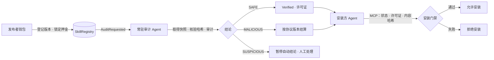

<div align="center">

# SkillGuard · 技能卫士

[简体中文](README.zh-CN.md) · [English](README.md) · [Español](README.es.md) · [日本語](README.ja.md)

### 在安装前核验 AI Agent 技能，让审计过程与链上结论可追溯

**技能版本注册 · 自动审计 Agent · MCP 安装门禁 · 独立仲裁与押金结算**


[项目规格](SPEC.md) · [角色页面验收](docs/ROLE-PAGES-ACCEPTANCE.md) · [审计 Agent 说明](docs/tool-agent-auditing.md) · [仲裁实施计划](docs/superpowers/plans/2026-10-08-independent-arbitration.md)

[打开在线只读看板](https://yishengsss.github.io/SkillGuard/)

</div>

> **线上版本说明**：当前 BOT Testnet（chain ID `968`）上的合约，以及在线只读看板展示的数据，均为 **协议 v1**。仓库包含 v2 独立仲裁的合约代码与页面，但 v2 尚未部署到 BOT；线上看板不会显示 v2 仲裁案件，也不能据此认为线上押金已冻结或受仲裁保护。请在签名前核对当前网络与 `deployments.json`。

## 目录

- [项目简介](#项目简介)
- [工作流程](#工作流程)
- [协议版本](#协议版本)
- [功能](#功能)
- [快速开始](#快速开始)
- [在线只读看板](#在线只读看板)
- [角色页面](#角色页面)
- [测试](#测试)
- [安全边界与已知限制](#安全边界与已知限制)
- [项目结构](#项目结构)
- [许可证](#许可证)

## 项目简介

SkillGuard 为 AI Agent 的技能供应链提供安装前核验流程。技能发布者登记具体版本和内容哈希；常驻审计 Agent 核验来源、扫描规则并提交报告；安装方 Agent 通过 MCP 工具检查链上状态、许可证及本地内容哈希，再决定是否安装。

人的操作由浏览器 EOA 钱包签名：发布者锁定押金，审计者运营方质押，管理员部署合约；协议 v2 中，独立仲裁者裁决暂定恶意案件，公共资金钱包领取对应资金。服务端准备交易并校验回执，不替发布者或管理员代签。

### 角色与职责

| 角色 | 主要职责 | 凭证 / 签名方式 |
|---|---|---|
| 发布者 | 登记技能版本、支付押金、领取退款 | 浏览器 EOA；CLI 演示使用 `PRIVATE_KEY` |
| 审计者运营方 | 质押、启动审计服务、处理 SUSPICIOUS | 浏览器 EOA；常驻服务使用 `AUDITOR_PRIVATE_KEY` |
| 管理员 | 部署、接线与激活合约 | 浏览器 owner 钱包；CLI 部署使用 `OWNER_PRIVATE_KEY` |
| 独立仲裁者（v2） | 在截止前核对证据并作最终裁决 | 独立浏览器 EOA；部署时配置公开地址 `ARBITER_ADDRESS` |
| 公共资金钱包（v2） | 领取确认恶意案件的公共资金份额 | 独立地址 `TREASURY_ADDRESS`，仅领取自己的 credits |
| 安装方 Agent | 查询许可证，核对哈希后请求安装 | 无钱包；通过 MCP 调用门禁 |

演示环境中，角色钱包由开发者控制。发布者、审计者和管理员地址必须互不相同；v2 仲裁者与公共资金地址也必须相互独立，且不能与 owner 重合。

## 工作流程



### 状态与处理

| 审计结论 / 链上状态 | 处理方式 |
|---|---|
| `SAFE` / `Verified (3)` | 铸造版本许可证；v1 立即退款，v2 记入发布者可领取余额。 |
| `MALICIOUS` / v1 `Malicious (4)` | 适用旧合约结算规则；此状态是既有 BOT 部署的行为。 |
| 暂定 `MALICIOUS` / v2 `ArbitrationPending (5)` | 押金被冻结，不支付给报告审计者、不铸造许可证；独立仲裁者在期限内裁决。 |
| v2 `ArbitrationExpired (6)` | 仲裁超时后押金记入发布者可领取余额；技能仍不能安装。 |
| `SUSPICIOUS` | 不自动提交链上结论；报告进入 `reports/pending/`，等待人工复核。 |

安装门禁只有在状态为 Verified、许可证存在，且本地 `codeHash`、`metadataHash` 与链上登记一致时才允许安装。

## 协议版本

| | 协议 v1 | 协议 v2 |
|---|---|---|
| 链上恶意状态 | `Malicious (4)` | 先进入 `ArbitrationPending (5)`，最终可变为 `Malicious (4)` 或 `Verified (3)`；超时为 `ArbitrationExpired (6)` |
| 押金处理 | 旧版合约逻辑 | 冻结后由仲裁结果/超时决定资金归属，采用 pull 领取 |
| 仲裁角色 | 无独立仲裁角色 | 独立仲裁者与公共资金钱包，一次配置后链上锁定 |
| 部署步骤 | Registry、License、双向接线 | 前四步不变；第五步配置仲裁者和公共资金钱包 |
| 当前 BOT 部署 | **当前 chain ID 968 的既有部署** | 未部署到 BOT；需另行部署与验收 |

v2 仲裁期限为 7 天。确认恶意时，押金记入公共资金钱包的可领取余额；推翻恶意时，发布者获得 VERIFIED 许可证并可领取退款；到期未裁决时，任何人可触发超时结算，退款归发布者但不铸证。仲裁报告保留原审计报告，不篡改原审计者的结论记录。

## 功能

- **版本登记与内容绑定**：每个技能版本分别登记来源、`codeHash` 和 `metadataHash`，避免用旧版本许可证覆盖新内容。
- **多阶段审计**：元数据规则、源码静态规则、仿冒包名检查；可选 LLM 一致性检查。常驻 Agent 使用配置的工具调用模型审计不可变源码快照。
- **审计记录**：规范化 JSON 报告以哈希关联链上结论；模型 Agent 的运行记录在可用时展示。历史记录若没有运行日志，会明确说明。
- **MCP 安装接口**：`check_skill` 只读查链；`install_skill` 只有在检查通过后才复制，并对副本再次核对哈希。
- **多角色页面**：技能库、发布者、审计运营、管理员、技能详情、安装、独立仲裁。
- **部署兼容性识别**：页面读取真实链上协议能力，不把 v1 合约显示成支持 v2 仲裁。

## 快速开始

### 环境要求

- Python 3.11+
- Foundry：`anvil`、`forge`、`cast`
- Node.js：仅运行浏览器逻辑测试时需要

```bash
git clone https://github.com/yishengsss/SkillGuard.git
cd SkillGuard

python3.11 -m venv .venv
.venv/bin/pip install -r requirements.txt
cp .env.example .env
```

在 `.env` 中设置 RPC 和角色配置。各私钥只用于本地 CLI/脚本路径；角色网页交易由浏览器钱包签名。

| 配置项 | 用途 |
|---|---|
| `RPC_URL` | Anvil 或已配置的 EVM RPC。 |
| `PRIVATE_KEY` | CLI 演示中的发布者钱包。 |
| `AUDITOR_PRIVATE_KEY` | 审计服务钱包：人工质押、CLI/worker 提交审计。 |
| `OWNER_PRIVATE_KEY` | CLI 部署脚本使用的管理员钱包。 |
| `ARBITER_ADDRESS`、`TREASURY_ADDRESS` | 可选的 v2 本地部署角色地址；两者必须互异且都不同于 owner。 |
| `LLM_API_KEY`、`LLM_BASE_URL`、`LLM_MODEL` | 常驻模型 Agent 必需；规则扫描 CLI 不需要。 |

**不要使用真实主网资产或真实钱包私钥运行本地演示。** `.env` 已被 Git 忽略。

### 一键本地演示

终端一启动 Anvil：

```bash
anvil
```

终端二运行完整流程：

```bash
./demo.sh --no-pause
```

脚本会检查角色钱包、按配置部署、由人质押、启动常驻 Agent、登记 `weather` 与 `mail-helper`，等待链上结论，然后通过 MCP 安装接口验证放行与拒绝。Agent 需要可用的 LLM 配置。再次运行前请重启 Anvil；已注册版本不会被覆盖。

临时切换到本机 Anvil、而不修改 `.env`：

```bash
DEMO_RPC_URL=http://127.0.0.1:8545 ./demo.sh --no-pause
```

### 在线只读看板

[打开 SkillGuard 看板](https://yishengsss.github.io/SkillGuard/)。该页面仅读取 BOT Testnet（chain ID `968`）上的现有 v1 合约，不连接钱包、不发送交易。v2 仲裁功能尚未部署到 BOT；线上仍适用现有 v1 合约行为。

### 启动网页应用

```bash
.venv/bin/python -m ops.server --port 8765
```

在浏览器打开 <http://127.0.0.1:8765/>。服务仅绑定本机 loopback；不要通过反向代理或公网暴露。

也可运行独立的 v2 角色体验环境。该脚本会创建独立 Anvil、部署全新的协议 v2 合约，并提供六个公开测试钱包（两位发布者、审计者、管理员、仲裁者、公共资金钱包）；不读取生产 `.env`，测试钱包不可接收真实资产：

```bash
.venv/bin/python tests/role_demo.py --rpc-port 18857 --port 18701
```

需要演示 v2 案件完整仲裁时可加 `--mock-agent`。页面会明确标注这是**确定性协议测试夹具，不是真实 AI 审计**；所有钱包和交易仅限该隔离 Anvil。

### MCP 安装服务

任何兼容 MCP 的 Agent 都可调用：

```bash
.venv/bin/python gate/mcp_server.py
```

stdio 工具名为 `check_skill(skill_dir)` 与 `install_skill(skill_dir)`。仓库中的 `demo-agent/.mcp.json` 是客户端配置示例；确保 MCP 客户端使用安装了项目依赖的 Python 解释器。

## 常用命令

```bash
# 离线规则扫描（不执行技能代码）
.venv/bin/python -m auditor.cli samples/weather

# 质押与常驻审计 Agent
.venv/bin/python -m auditor.stake
.venv/bin/python -m auditor.agent [--once] [--from-block N] [--poll SECONDS]

# 人工处理 SUSPICIOUS
.venv/bin/python -m auditor.cli <skill-dir> --submit --human-decision safe
.venv/bin/python -m auditor.cli <skill-dir> --submit --human-decision malicious

# 安装门禁
.venv/bin/python gate/gate.py install samples/weather

# 测试
(cd contracts && forge test -vv)
.venv/bin/python -m pytest -q -m 'not anvil'
node --test tests/web/*.test.mjs
```

### 新部署 v2 仲裁协议

在全新本地 Anvil 测试时，在 `.env` 额外配置：

```dotenv
ARBITER_ADDRESS=0x...   # 独立仲裁钱包地址，不是私钥
TREASURY_ADDRESS=0x...  # 公共资金钱包地址，不是私钥
```

部署脚本只有在两项都配置且角色分离时才启用协议 v2；角色配置一经链上确认不可修改。现有部署切换网络或地址会改变部署作用域，既有注册、质押和报告不会迁移。BOT 上的既有 v1 合约不会因更新代码或 README 自动升级。

## 测试与验收

```bash
# 常规 Python 回归
.venv/bin/python -m pytest -q -m 'not anvil'

# 角色 HTTP、部署、交易核验及本地链集成
.venv/bin/python -m pytest tests/test_roles_e2e.py tests/test_ops_chain.py \
  tests/test_ops_transactions.py tests/test_ops_admin.py -q

# 浏览器模块测试
node --test tests/web/*.test.mjs

# Solidity
(cd contracts && forge test -vv)
```

角色页面与 BOT 只读验收记录见 [docs/ROLE-PAGES-ACCEPTANCE.md](docs/ROLE-PAGES-ACCEPTANCE.md)。该记录注明了实际测试结果、历史部署版本与未覆盖的真实钱包扩展弹窗测试。

## 安全边界与已知限制

- 演示样本是**惰性文本夹具**：源码里有触发规则的示例字符串，但不会读取真实凭据、联网或执行外部命令。
- 规则扫描可能漏报，也可能误报；审计结果不是安全证明。
- 上传的源码文件必须是 UTF-8 文本，确保模型 Agent 能完整检查所有参与哈希的文件；二进制文件会被拒绝，不会静默跳过。
- 审计结论由单个审计者提交。v1 没有独立仲裁；v2 有仲裁但仲裁判断仍可能出错。
- 当前没有审计费，审计者质押不能取回；资金结算规则依合约协议版本而异。
- Agent 只支持项目根内的本地来源；Git 远程拉取未实现。Agent 不执行上传的技能代码。
- MCP 安装门禁依赖 Agent 按配置调用工具，不是操作系统或 Agent 平台强制安装钩子。
- 网页服务端是本机信任边界，含本地配置与审计服务能力，只适合 loopback 演示和开发测试。
- 当前 BOT 历史部署是 v1，README 不执行 BOT 部署、迁移或任何链上交易。

路线图见 [SPEC.md](SPEC.md) §11.3。v2 仲裁流程设计与验收过程见 [实施计划](docs/superpowers/plans/2026-10-08-independent-arbitration.md)。

## 项目结构

| 路径 | 说明 |
|---|---|
| `contracts/` | Solidity Registry、ERC-721 License、Foundry 部署脚本与测试。 |
| `auditor/` | 规则扫描、报告哈希、常驻 Agent、worker、运行记录与恢复。 |
| `gate/` | Python 安装门禁与 MCP 安装服务器。 |
| `ops/` | 本地 HTTP 应用、钱包认证、交易准备/核验、审计与仲裁服务。 |
| `web/` | 多角色页面、只读看板与共享浏览器模块。 |
| `rules/` | YAML 静态规则与包名清单。 |
| `samples/` | 安全、恶意、待审计等演示技能夹具。 |
| `tests/` | Python、Foundry、Node 与隔离 Anvil 回归测试。 |
| `docs/` | 规格、验收记录、审计与仲裁说明。 |

## 许可证

本项目采用 [MIT License](LICENSE)，与 Solidity 合约的 SPDX 标记一致。第三方依赖及其子模块仍分别适用各自的许可证；使用前请查看对应项目的许可声明。
